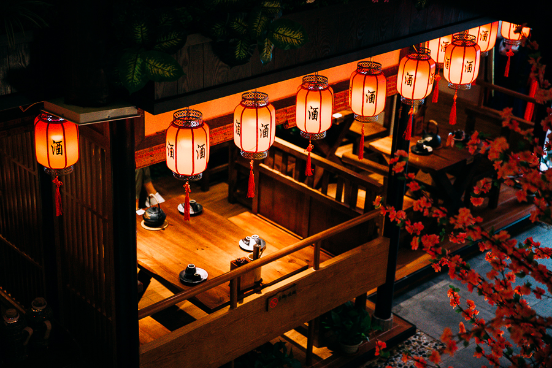
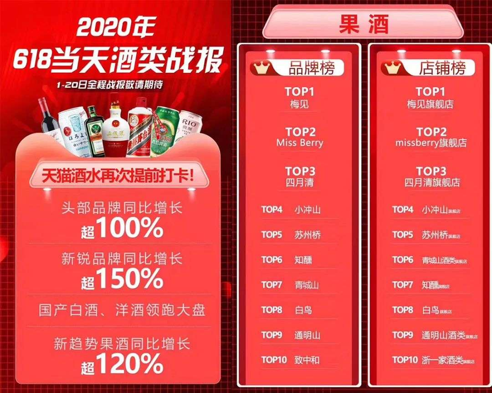
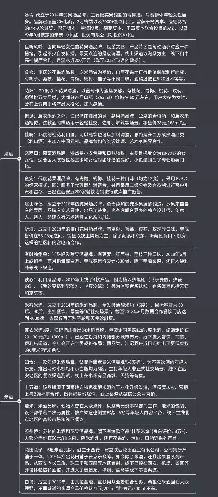

[toc]

# 果酒产业

## 行业格局

### 新兴品牌

 #### 冰青

* 醉美丝路（北京）国际商贸有限公司
* 简介
  * http://www.putiancooldrink.com/
  * 青梅酒 10.8-12°
  * 陈涛（中粮➡️新丝路传媒）
  * 2014年
  * 2019年8月，冰青获得由亲亲（中国）投资有限公司领投，红牛中国前任总裁王睿个人跟投的千万级别A＋轮融资；此前，冰青已完成由京东千树资本领投、唐德影视跟投的PreA轮，以及由君洋资本、宝海投资、德商资本及千章资本联合投资的数千万A轮融资。
* 生产：通过子公司四川梅鹤酒业有限公司组织生产，在四川省大邑县有一个面积8000亩的种植基地
* 销售：渠道覆盖了京东、天猫、小米有品、云集等近二十家电商平台，以及盒马鲜生、7FRESH、超级物种连锁商超、便利店体系约2万家售点。**此外还进驻了湊湊、朝天门、谭鸭血、小龙坎、权金城等餐饮店**——尤其是火锅业态的渠道。（[亿欧网](https://baijiahao.baidu.com/s?id=1650684441527722299&wfr=spider&for=pc)）

#### Missberry

* **格英（上海）品牌管理有限公司**

* 简介：
  * 无官网， [微博贝瑞甜心](https://weibo.com/p/1006067406771644/home?is_hot=1)
  * 唐慧敏
  * 主打女性饮酒8-10度
  * 2019年成立
  * 2020.4，[尚承嘉寻投资、世相科技，数百万人民币](https://www.tianyancha.com/company/3372597600)
* 生产：因无食品生产许可证只有经营许可证，生产环节不涉及
* 销售：线上旗舰店[淘宝](http://missberry.tmall.com/)；[京东](https://mall.jd.com/index-1000306582.html)；

#### 且听风吟

* **杭州往事重现品牌管理有限公司**
* 简介
  * 无官网
  * 俞文凯
  * 10～12度的瓶装花果酒
  * 2015年成立
  * 无融资
* 生产：只有经营无生产许可证
* 销售：线上

#### 有时果酒

  * **北京九久优享网络科技有限公司**
  * 简介：
    * [www.youtimewine.com](http://www.youtimewine.com/)
    * 李泓江
    * 一款适合女生喝的小瓶装美容蓝莓酒
    * 2016年成立
    * [种子轮天奇创投150万](https://www.pencilnews.cn/p/15268.html)
  * 生产：蓝莓酒从加拿大Coastal Black酒庄进口，每一瓶都由300颗蓝莓酿造而来。桑葚酒则是由国内华南地区某红酒厂代酿造，并最终由有时确定口味
  * 销售：无淘宝旗舰店，据称[淘宝、enjoy、小红书等电商平台售卖，截至目前，公司月销近1万单，月销售额约100万元。](https://www.pencilnews.cn/p/15268.html)

#### 花肆

* **大理耘谷玫瑰产业有限公司**--》**成都认真生活科技有限公司**
* 简介：
  * 无官网
  * 杨立勋
  * 专门的发酵酒，这其中80%—90%的原材料使用了葡萄发酵。在果酒的甜度、酸度、果香上也做了控制，主打甜度酒，比较适宜女性。
  * 2016年
  * 无融资
* 生产：无生产许可证
* 销售：

#### 繁醉花亭

* **天津市繁醉花亭餐饮管理有限公司**
* 简介：
  * 无官网
  * 张稷强，[繁醉花亭团队目前共有20人，总部位于深圳。创始团队都是餐饮行业的连续创业者，张付君此前做了两个餐饮外卖品牌，目前连锁门店已经超过2000家。](https://www.toutiao.com/i6815351446293185032/)
  * [繁醉花亭的第一款果酒于2017年10月上市，目前保持季度更新，现在一共有50余款，其中桃花酒、玫瑰酒、荔枝酒、青梅酒是繁醉花亭主打的爆款。定价方面，一壶半斤的果酒49-59元，一斤的99-129元。--36kr 2020.4](https://www.toutiao.com/i6815351446293185032/)
  * 2016
  * [番茄资本的种子轮融资](https://www.toutiao.com/i6815351446293185032/)
* 生产：
* 销售：[繁醉花亭的中式居酒屋选址在一线商圈，100-150平米之间.繁醉花亭从深圳起步，在福州、兰州、内蒙等全国20多个城市采取城市合伙人的模式，目前中式居酒屋已经开业25家，入驻永辉超市的店中店有40多家，而专卖店也有40多家。2019年繁醉花亭在线下一共卖出80万壶酒，销售收入达3300万。受疫情影响，繁醉花亭计划推迟到6月继续开店，今年的开店目标是新增200家。今年4月，繁醉花亭也开始布局天猫、小红书等线上渠道。--36kr 2020.4](https://www.toutiao.com/i6815351446293185032/)

### 酒企拓展

#### 梅见

* 重庆江小白品牌管理有限公司

* 简介：

  * 背后是江记酒庄
  * 2019年推出
  * 青梅酒（高粱+青梅汁），定位佐餐酒

* 生产：[梅见的背景是江记酒庄，拥有5位国家级酒行业评委和760亩生产基地，全国顶尖研发团队早在几年前就开始青梅酒的产业研究。据梅见研发团队刘博士介绍，尝遍了各种青梅后，梅见采用普宁青梅，拥有国家地理标志认证，90天糖渍工艺缓慢出汁，保留纯粹青梅滋味。基酒选用的单纯高粱酒，跟其他白酒比起来口感更纯净，杂味更少，能更好的跟青梅融合，达到酸甜平衡，没有杂味。](https://mp.weixin.qq.com/s?src=11&timestamp=1596348843&ver=2497&signature=zlHX9tq9DxV9BteRVk92jJr4HZo6*HE7eJxEhYWsJerFmLtsNriXkKhBk546-eGNAmVhvm21yxbx1IdyX-DRE1QeaoKmn1Cu31eIblIBufpBwzrKpUIoNYkHWRY5HT6u&new=1)

* 宣传+销售：

  * TVC：[在这个夏天，梅见跑遍中国普宁、大理、广州还有日本福井，从原料、文化、风味和工艺四个维度打造了一组颇具纪录片气息的TVC，并邀请了四位在各自领域都颇具权威的人物担任“梅鉴”代表人，跨越时间和空间，从四个维度品鉴青梅酒，引出对好梅酒的定义，重新勾勒青梅酒的形象。--中新网](https://new.qq.com/omn/20200722/20200722A0MU9M00.html)

  * 线上+线下合作定位佐餐酒

    

  * [李佳琦在直播间也为梅见青梅酒打call，从口味到多种饮法都获大赞，短短5分钟内就卖出了10万瓶。](https://new.qq.com/omn/20200722/20200722A0MU9M00.html)

    

#### 泸州老窖桃花醉

  2017年《三生三世十里桃花》的上映，泸州老窖植入的一款玫瑰李子酒桃花醉借势走红，月销量4000多瓶，剧集上线两个月，总销售额超3000万。目前桃花醉仍月销量只有数百瓶。

#### 茅台悠蜜

  2015年《欢乐颂2》的上映，带火了茅台集团旗下的果酒“悠蜜”，但由于口味没能及时更新，不到两年销售份额下降，到今天市场上已经难觅悠蜜其踪影。

### 其他品牌

* Hoopos 酒品进口外贸的创业品牌
  * [酒饮消费转型，西打酒品牌「Hoopos」完成千万级Pre-A轮融资｜早起看早期](https://mp.weixin.qq.com/s/sV-DunhjHYXqTD_R3bs5Dg)
  * 包装看起来像是抄的瑞典的Rekorderlig，这个瑞典品牌我身边人很多觉得挺好喝
* clot 山东青岛的苹果酒创业品牌
  * 品牌简介：[品牌故事丨你好，这里是CLOT cider](https://mp.weixin.qq.com/s/v-vfiTDnUyW7TBqYdXBzUw)
  * 同程资本的一份考察：[「投资人笔记」Clot cider：专注为年轻女性用户调制的苹果配置酒](https://mp.weixin.qq.com/s/Hp-cZcvIXadTwuv2LANxoQ)

## 行业观察
### 产业报告
* [邹文武：中国果酒发展白皮书2015-2018](https://mp.weixin.qq.com/s/8MdEf6Q3IosMAFZHvn4LkQ)
  * 算了一下建厂的成本，土地+厂房1500万，设备要1200-1500万，前期团队500万，广告和市场推广前三年1500万。这样总共按照3-5年规划，投资5000万-1亿，可以打造一个果酒行业的标杆品牌，同时在持续的覆盖和影响下，企业可以迅速奠定在行业中的销售规模，三年销售规模可以3000万到6000万再到1.2亿突破。
  * 对生产各个环节介绍也比较全。
  * 像是打广告选择性看

### 媒体报道
* [酒业观察｜强势增长，“千亿”果酒市场能否成下一个风口 新京报2020-07-09](https://m.bjnews.com.cn/detail/159426500315514.html)
* [果酒峰会称果酒市场潜力大，品质低端化严重 新京报 2019-12-08](https://m.bjnews.com.cn/detail/157580935015130.html) 

### 业内观点
* [什么好喝的果酒那么少？为什么果酒市场没有老大 知乎 2017](https://zhuanlan.zhihu.com/p/28619950?utm_source=wechat_session&utm_medium=social&utm_oi=35061298626560&utm_content=sec)
  
  * 国内专门种植酿酒果品的少，研究酿制工艺的科研力量不足，需要培养消费者口味
  
* [说到“上头”，这里有一份酒饮行业图谱](https://mp.weixin.qq.com/s?__biz=MzA3ODEzMjg5Mg==&mid=2651671509&idx=2&sn=b0ec249618a67da0046b637911814453&chksm=84be8826b3c9013035a7d109c08ad9a34a7d6d9e04e73144ba4f51819b9110ac90d3ad991b7f&scene=21#wechat_redirect)

  * 

  * [“有品类无品牌”，为什么果酒市场没有老大？-FBIF食品饮料创新-2020-05-28](https://mp.weixin.qq.com/s?src=11&timestamp=1596047433&ver=2490&signature=jGJ08TEbr*sePqWmE3CNHUvfPXtmoB3eEgXZ9RGwImkYcC1tnPIhHNzwgfQreAIXK49QAT0lne5KUP0NExhM5Gu3J2YWH9R7v*FZDceIhUOy7tsIneoxV*brBrvU6ZV-&new=1)
    * 线上销售潜力大：在天猫55大促中，果酒增长超过400%，梅子酒增长超过1000%，表现突出，其中就包括梅见、Miss Berry等主攻线上渠道的新锐果酒品牌
    * 现存问题：
      * 品控不行，因为不是主营业务，而是“兼职”，五粮液、茅台、泸州老窖、古越龙山等众多酒类行业龙头一股脑地加入到果酒产业中来，却没有完成对整个果酒产业的深度推进。2015年茅台集团曾以蓝莓酒为主打，推出过果酒品牌“悠蜜”，出现在热播电视剧《欢乐颂2》中，首年销售达2.4亿，但因为产品口感不行，第二年销售就萎缩了。
      * 产品同质：表面上来看，电商渠道的国产果酒品牌可谓层出不穷，但实际上同质化非常严重。据知乎答主青枝透露，国内果酒90%以上都是贴牌生产，差异并不大。
      * 国外品牌占据：由于国外果酒行业发展早，已经形成了很多代表性的品类。比如法国的苹果酒、德国百人城的李子酒、Kirschlikor的樱桃酒，还有日本的梅子酒、美国的绿雾酒等。
    * 解决：
      * 研发生产：品控
      * 市场：现在果酒行业“长尾”竞争已经初见端倪，一些互联网果酒品牌，如Miss Berry、小冲山、知醺等，已经打下了一定的基础，它们非常擅长视觉的打造，从高颜值的包装到平面设计顺应年轻人的审美，同时，它们也在通过直播、KOL推荐等方式走出去，在李佳琦直播间，Miss Berry果酒一晚上销售量达5万+瓶。
      * 品牌：如果果酒品牌能更重视品牌打造，而不是一味地宣传原料产地和养生功效，则会更有希望破局。相对而言，新锐品牌中梅见和冰青的品牌意识是更强的。

## 附录

| 公司                         | 融资情况 | 成立时间      | 旗舰店粉丝数 | 口味（度数）                            | 价位（元） | 简介                                                         |
| ---------------------------- | -------- | ------------- | ------------ | --------------------------------------- | ---------- | ------------------------------------------------------------ |
| 冰青                         | A+轮     | 2014          | 5108         | 青梅(10.8-12° )                         | 53         | 冰青是一个果酒制造商，基于无添 加的健康理念，采用全果酿制技术 |
| Missberry                    | 未融资   | 2019          | 56995        | 水果(8-10° )                            | 79         | 低浓度微醺女性酒品牌，以青梅酒 和果酒为主                    |
| 米客                         | 天使轮   | 2014          | 13.8w        | 花果(6° )                               | 29.9       | 一个发酵型原酿米酒品牌，混以特 色水果口味                    |
| 开醺                         | 未融资   | 2018          | 5648         | 花果(11.5° )                            | 34.9       | 主打果味葡萄酒，有覆盆子口味红 葡萄酒和奇异果口味白葡萄酒    |
| 且听风吟                     | 未融资   | 2015          | 44.2w        | 花果(10-12° )                           | 97         | 针对女性的花果酒品牌                                         |
| 有时果酒                     | 天使轮   | 2016          | 暂无旗舰店   | 蓝莓(10° )                              | 59         | 一款适合女生喝的小瓶装美容酒                                 |
| 花肆                         | 未融资   | 2016          | 21.0w        | 花果（5-12° ）                          | 55.2       | 花肆做的是专门的发酵酒，其中80%—90%的原材料使用了葡萄发 酵   |
| 繁醉花亭                     | 种子轮   | 2017          | 暂无旗舰店   | 花果(12° )                              | 38.5       | 主打年轻女性的新酒饮，线下中式 居酒屋和线上销售结合          |
| 苏芈娘                       | 未融资   | 2015          | 13.9w        | 花果（4-15° ）                          | 47         | 一个面向女性的花果酒品牌，受众 年龄以40〜50岁为主            |
| TOT气泡饮 （农夫山泉）       |          | 2020 (1996)   |              |                                         |            | 国内首款果汁气泡饮，分为米酒口                               |
| 未融资                       | 73.6w    | 米酒（0.5° ） | 5月底上市    | 味、柠檬红茶、柚子绿茶；目标受 众为95后 |            |                                                              |
| 食喜                         | 未融资   | 2016          | 48483        | 花果(5-8° )                             | 91         | 旗下有两大产品系列，分别为壹壶 与墨雅                        |
| 仙林青梅 （五粮液）          | 已上市   | 2014 (1909)   | 旗舰店未销售 | 青梅（10° ）                            | 收藏品     | 五粮液十二星座青梅果酒系列                                   |
| 桃花醉 （泸州老窖）          | 已上市   | 2016 (1995)   | 336.8w       | 水果（22° ）                            | 180        | 泸州老窖出产的配制酒，果汁含量 50%,目标受众为25-30岁女性     |
| 悠蜜UMEET                    | 未融资   | 2015          | 3391         | 蓝莓（6° ）                             | 27.3       | 贵州茅台旗下公司，果酒生产销售 服务平台                      |
| 苏州桥                       | 未融资   | 2017          | 10.9w        | 花果米酒（6-10° ）                      | 53         | 源于老字号“钱义兴酒坊”，以低 度米酒、果酒为主                |
| 小冲山                       | 未融资   | 2018          | 18803        | 水果(5-6° )                             | 60         | 中国传统酿造工艺，主打米酒和低 度女士果酒                    |
| 知醺                         | 未融资   | 2018          | 29156        | 酸奶水果（6-10° ）                      | 34         | 重庆巴氏酒业旗下品牌，主打低度 酸奶水果酒                    |
| 听海                         | 未融资   | 2018          | 27335        | 花果（4-12° ）                          | 65         | 低度女士花果味酒原酿米酒品牌，产品采用淋饭法降               |
| 白鸟                         | 未融资   | 2017          | 3622         | 花果米酒（6-13° ）                      | 89         | 温、糖化发酵、压榨过滤等制作工 艺                            |
| 三生石                       | 未融资   | 2016          | 92971        | 花果（6-12° ）                          | 85         | 一家研发、酿造与销售白酒的企业                               |
| 青城山                       | 未融资   | 2014          | 2128         | 水果(10° )                              | 68.5       | 成都青弥酒业旗下产品，以梅子酒 、孑弥猴桃口味为主            |
| 食口也                       | 未融资   | 2019          | 3763         | 水果(10° )                              | 72         | 主打低度果味酒、糯米酒、青梅酒                               |
| 本味寒造                     | 未融资   | 2019          | 1929         | 青梅(11-13° )                           | 64.9       | 一年一造，低温慢酿是本味寒造的 特色                          |
| 溪山隐记                     | 未融资   | 2014          | 22196        | 花果（4-12° ）                          | 64         | 诗酒田园旗下产品，主打低度花果 酒                            |
| 梅见                         | 未融资   | 2019          | 25425        | 青梅(12-14° )                           | 122        | 江小白旗下产品，专注做低度青梅 酒系列                        |
| 仍W兔                        | 未融资   | 2019          | 815          | 水果（10° ）                            | 87         | 低度女士微醺果酒，主要分为蜜桃 、荔枝系列                    |
| 醉香田                       | 未融资   | 2014          | 10872        | 花果米酒（0.5° ）                       | 34.9       | 主打低度花果味糯米酒                                         |
| 对花吟                       | 未融资   | 2010          | 83165        | 花果（3-12° ）                          | 53         | 低度小众花果味酒                                             |
| 蔓酌                         | 未融资   | 2010          | 10031        | 酸奶花果（6-12° ）                      | 61         | 目标群体为女性，主要产品为酸奶 花果酒                        |
| 失重原野                     | 未融资   | 2019          | 55           | 水果（4° ）                             | 14.5       | 主打低糖低卡零脂肪起泡苏打酒                                 |
| Chill轻尔 （熊猫精酿）       | A+轮     | 2020 (2015)   | 63797        | 白桃(3.5° )                             | 8          | 0糖硬苏打饮料，每罐热量66卡                                  |
| Hard Seltzer                 | 已上市   | 2019          | 76188        | 水果（5。）                             | 13         | 低酒精度且低热量的硬气泡水，每                               |
| （百威英博）                 | (2011)   | 罐热量99卡    |              |                                         |            |                                                              |
| White Claw                   | 未融资   | 2016          | 暂无旗舰店   | 水果（5。）                             | 15         | 低热量低卡路里系列"汽水酒"， 不以性别区分消费者              |
|                              |          |               |              |                                         |            |                                                              |
| 小饭桌绘制，2020年8月2日更新 |          |               |              |                                         |            |                                                              |