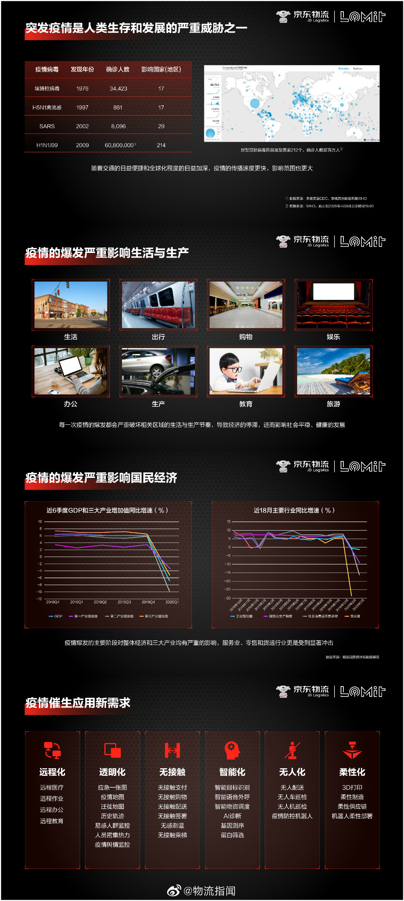
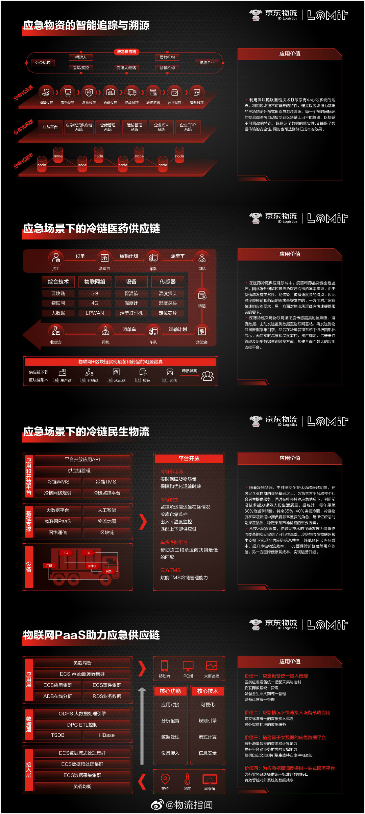

* [37页PPT：京东物流2025实验室发布研报，疫情如何“激活”供应链科技创新？](https://weibointl.api.weibo.cn/share/144891326.html?weibo_id=4501551261881362)

  > 【37页PPT：京东物流2025实验室发布研报，疫情如何“激活”供应链科技创新？】4月28日，京东物流2025实验室发布了《“新基建”引领创新突破系列研究报告》，阐述了由突发公共事件带来的应急需求如何驱动技术变革与升级。
  >
  > 应急需求驱动下的技术体系，到底聚焦于哪些领域，又应用于哪些应用场景呢？ 

  

  

  

  

  

  

  

  

  

* 2019高标仓储行业深度报告：总体供不应求

* 

* 

